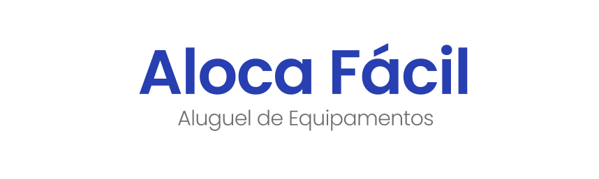

# Aluguel de Equipamentos

## 📌 Objetivo do Projeto
O projeto **ALOCA FÁCIL** tem como objetivo desenvolver uma solução digital, em formato mobile, voltada para o aluguel de equipamentos diversos — como ferramentas, eletrônicos e itens profissionais — por meio de uma plataforma colaborativa, onde qualquer usuário pode se cadastrar e anunciar seus próprios equipamentos para alugar, visando oferecer uma alternativa prática, econômica e segura tanto para quem deseja alugar quanto para quem deseja obter renda extra com itens que possui.

## Equipe

| NOME                | Função   | E-MAIL                 |
| :------------------ | :------ | :--------------------- |
| Danielle Melo | Analista | danielle.melo@estudante.ifro.edu.br |
| Taline Rodrigues | Analista | talinefranca32@gmail.com |
| Silvio Ruan | Analista | silviohuan@gmail.com |
